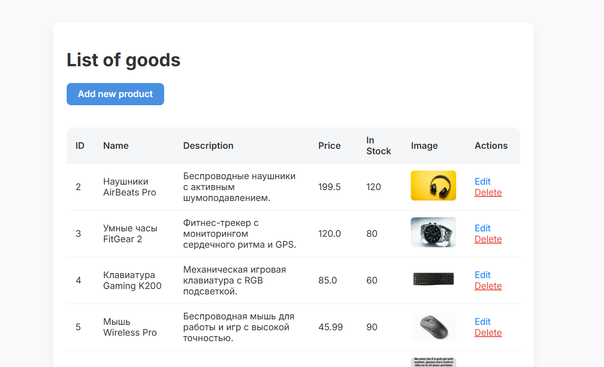
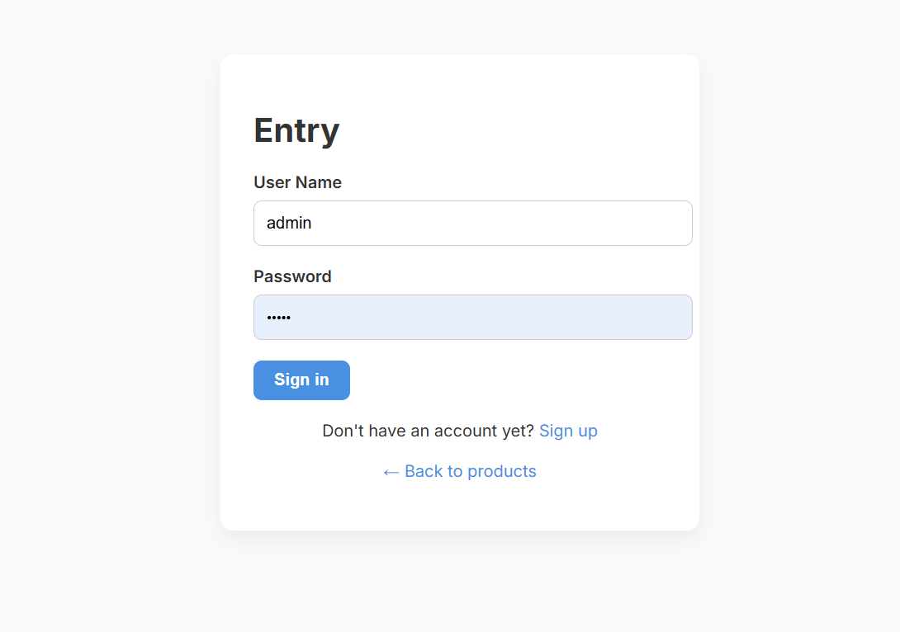
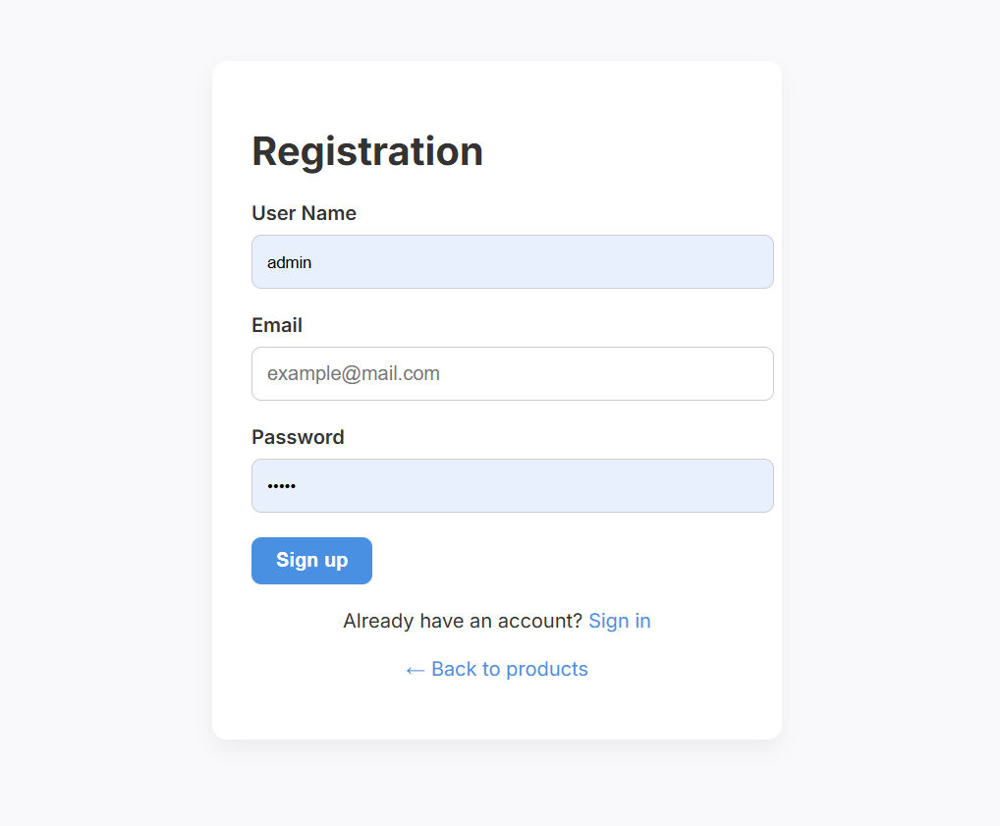
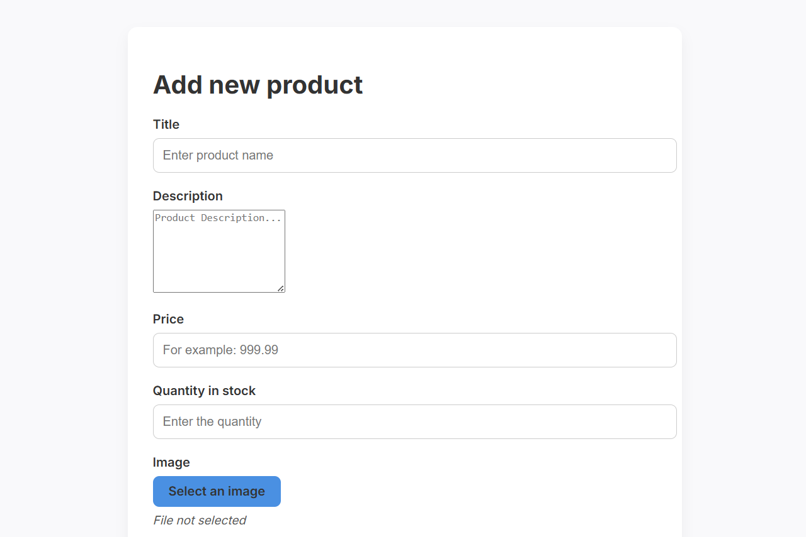

# LittleShop

## Content
* [General info](#general-info)
* [Demonstration](#demonstration)
* [Technologies](#technologies)
* [Features](#features)
* [Setup](#setup)
---
## General info
This project is a small product store application built with Spring Boot.
It supports role-based access control:
- User — can browse the product catalog (view products, see details).
- Admin — has full management rights (add, update, delete products, manage roles/users).
The application demonstrates a secure, database-driven system with authentication, authorization, and product management.

---
## Demonstration
Here we can see what the product list looks like for the administrator, i.e. it is possible to add, delete and edit products:


This is what the registration page looks like:





---
## Technologies
Essentials:
- Spring Boot 3.2.5 – the main framework that simplifies the creation of Java applications.
- Java 17 – language version.
- PostgreSQL – DBMS, connection via JDBC driver.

Spring Boot starters:
- spring-boot-starter-data-jpa – working with a database via JPA/Hibernate.
- spring-boot-starter-thymeleaf – template engine for web interfaces (HTML).
- spring-boot-starter-web – creating REST and MVC web applications.
- spring-boot-starter-security – security, authentication, and authorisation.
- spring-boot-starter-test – testing (JUnit, Spring Test, Mockito, etc.).

Validation:
- Jakarta Validation API (3.0.2) – specification for validation.
- Hibernate Validator (8.0.1.Final) – implementation of Jakarta Validation.

Templates and security:
- thymeleaf-extras-springsecurity6 – integration of Thymeleaf with Spring Security (e.g., role checking directly in the template).

Utilities:
- Lombok (1.18.30) – reduction of boilerplate code (getters/setters/builders, etc.).

Build:
- Maven – build system.
- maven-compiler-plugin – plugin for Java compilation, with annotation support (Lombok).

---
## Features

There are too many files here, but their meaning is quite simple, so it's better to focus on the output of our software!

Startup
The app starts very fast (~3s):
```
2025-09-05T17:47:08.370  INFO ... Started LeronApplication in 3.184 seconds
```

Repositories and entities are detected automatically:
```
Found 3 JPA repository interfaces
```

User & Role System
On startup the system checks roles and admin user:
```
Initializing roles and admin user...
```


Data model includes:
- users
- roles
- user_roles
- products

Product Catalog
Supports pagination and queries on products:
```
select p1_0.id, p1_0.name, p1_0.price from products p1_0 limit ? offset ?
```

Security
Spring Security filters are initialized:

Securing application with Spring Security filters...

Known Warnings
```
spring.jpa.open-in-view is enabled → should be disabled in production.
```

Hibernate notes:
```
HHH90000025: PostgreSQLDialect does not need to be specified explicitly
```
Missing favicon (GET /favicon.ico).

Shutdown
The app gracefully closes database connections:
```
HikariPool-1 - Shutdown completed.
```
This project demonstrates a secure, database-driven Spring Boot application with authentication, role management, and product handling, ready for further extension (e.g., REST API or frontend integration).

---
## Setup
Just install the latest Release :)
